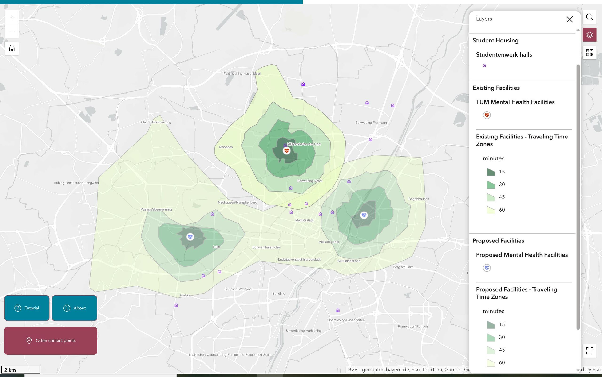

# The Journey to Your Wellbeing: Mental Health Accessibility Analysis
*A geospatial analysis project developed at the Technical University of Munich (TUM) for the Cartography & Geoinformatics M.Sc. program.*
## Project Overview
This project develops a geospatial framework and an interactive dashboard to optimise student access to mental health facilities in Munich. Specifically, it provides an assessment of the physical accessibility of International students at TUM to Mental Health Facilities. By transitioning from a baseline assessment to predictive routing, the analysis demonstrates a strategic increase in accessibility from **21% to 60%**. This framework is intended for implementation by TUM to ascertain the optimal locations for new facilities, informed by the concentration of student housing.

## 🔗 Live Interactive Dashboard
[(https://experience.arcgis.com/experience/6
846a9dd69524e4583bd262b8c0b92fe/)]
*Click to explore the web map allowing students to find the closest facility and aiding stakeholders in infrastructure planning.*

## Objectives
The primary objective of this study was to evaluate the physical accessibility of existing mental health facilities for international students and to propose a framework for geographical infrastructure enhancement[cite: 5]. The core of our research asked a vital question: do existing mental health facilities truly offer accessibility to students with a maximum commute of 30 minutes? [cite: 23]

## Datasets Used
* **International student private residences:** Primary data collected via ArcGIS Survey123.
* **Studentenwerk Halls of Residence:** Extracted via OSM API.
* **Existing Mental Health Facilities (TUM):** Extracted via OSM API.
* **Street Network:** Oberbayern Street Network data (OSM).
* **Transit Schedules:** General Transit Feed Specification (GTFS) for Munich public transport.

## Software & Module Stack
* **Software Stack:** Python, Jupyter Notebook, ArcGIS PRO, ArcGIS Online, Experience Builder, SURVEY 123, GitHub.
* **Module Stack:** `r5py`, `geopandas`, `TravelTimeMatrix`, Kernel Density Estimation (KDE), `pandas`, `os` (operating system), `datetime`.

## Detailed Methodology

### 1. Baseline Analysis (The Spatial Gap)
The first phase of the study involved a baseline analysis to assess the current physical accessibility of Existing Facilities for students living in Private Residences and Studentenwerk halls of residence. The `r5py` routing engine ingested with OSM network, GTFS, Student survey data, and Studentenwerk halls data was used to build a navigable transport network and calculated the reachable existing mental health facilities for 15, 30, 45, and 60 minutes. This analysis revealed a gap of only **~21% of the residences being within 30 minutes of the existing facilities mental health facilities**.

### 2. Strategic Site Selection & Multi-Modal Network Routing
To address this gap, Kernel Density Estimation (KDE) Clustering was used to perform a spatial density analysis of students’ residences to identify hotspot zones. Based on this analysis, 3 optimal locations were proposed to maximise facility coverage.
Using the proposed locations as a baseline, another network routing similar to the existing facilities was performed. 

Isochrones were generated as vector polygons around the existing and proposed facilities using 15, 30, 45, and 60-minute time thresholds. These boundaries were computed based on the Bavaria street network and public transport schedules, generating multi-modal service areas.

### 4. Web GIS Integration & Impact
These isochrones are the final export ingested into Experience Builder to create a web map. This serves as a crucial strategic resource for the university while simultaneously offering support and relief to every student managing their mental health journey. The validation showed approximately **40% increase in coverage, i.e., 60% of the students living in private residences and studentenwerk halls of residence are now within 30 minutes of the necessary help**.  

## Future Scope
Our survey data include information on international students' nationalities and preferred languages. Although some facilities offer English services, many TUM international students in distress, particularly those from non-English speaking countries, would prefer to communicate in their native language. Consequently, our future strategy will focus on addressing the language gap among service providers and reducing wait times, which are significant obstacles for mental health services in Germany.

## 📚 References
* Ansari Lari, S., Zumot, M. S., and Fredericks, S. (2025). Navigating mental health challenges in international university students: adapting to life transitions. *Frontiers in Psychiatry*, 16 (1574953). https://doi.org/10.3389/fpsyt.2025.1574953
* Xie, Q., Zhu, Y., Lin, T., Yin, Z., and Goldberg, S. (2024). Bridging the Mental Health Care Gap for International Students via Digital Interventions [Preprint] ResearchGate. https://doi.org/10.31234/osf.io/8b3j9
* Shek, C. H. M., Chan, S. W. C., Stubbs, M. A., and Lee, R. L. T. (2024). Promoting International Students' Mental Health Unmet Needs: An Integrative Review. *International Journal of Mental Health Promotion*. https://doi.org/10.32604/ijmhp.2024.055706

## Contributors
* **[Aderonke M. Adetoro]** - [[let's connect](http://linkedin.com/in/adetoro-aderonke)]
* **[Erika Pazmino]** - [[Erika on Linkedin](https://www.linkedin.com/in/erika-pazmi%C3%B1o-ch-507738165?utm_source=share_via&utm_content=profile&utm_medium=member_ios)]

*Special thanks to my project partner and supervisor for their guidance throughout this analysis.*
---
*Note: The raw residential coordinate datasets have been excluded from this repository to ensure the privacy of TUM students. Code logic and methodology remain transparent within the provided scripts.*